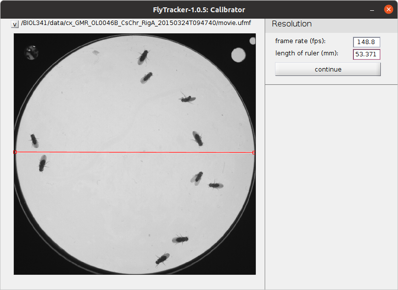
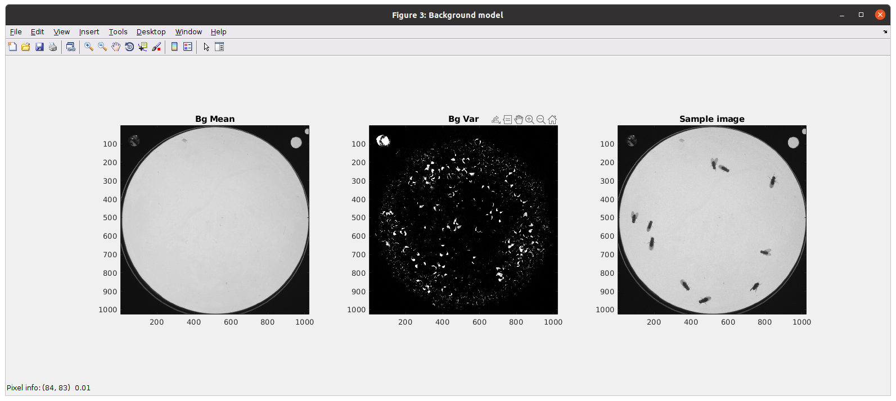
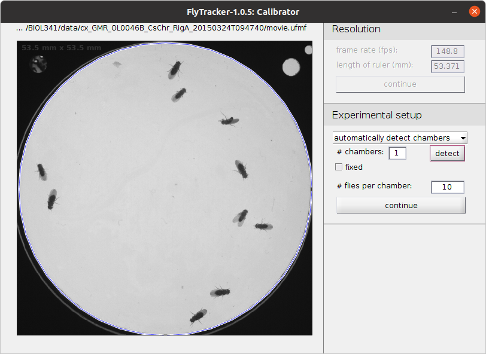
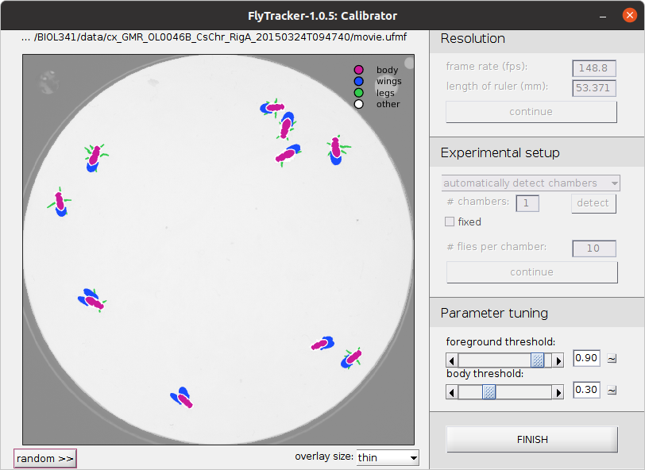
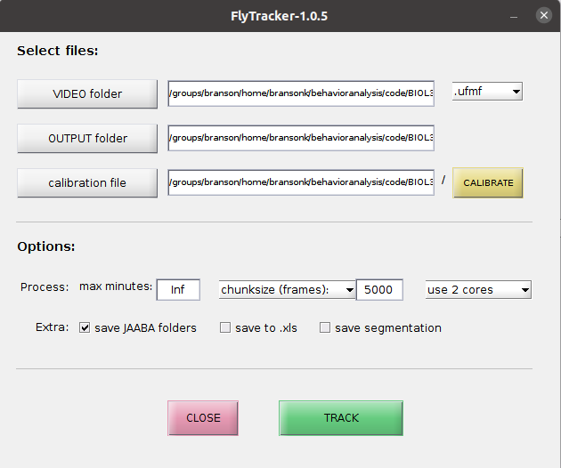
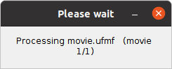
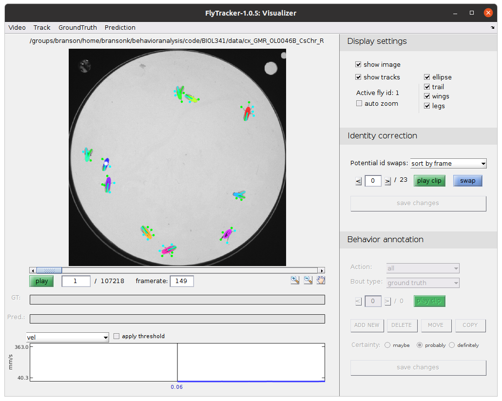

# FlyTracker tutorial

1. In MATLAB, navigate to the `FlyTracker` directory. 
2. At the MATLAB prompt, type `tracker`. This will open the FlyTracker GUI.
3. Click **VIDEO folder** to select the _experiment directory_ containing your video (`movie.ufmf`).[Screenshot of the FlyTracker dialog](ScreenShotSelectVideo.png)
4. Click **CALIBRATE** to set parameters.
5. In the _Calibrator_ drag the line to match the diameter of the arena. Set the **length of ruler (mm)** to be **53.371**, the diameter of the arena. This is how we tell FlyTracker how to convert from pixels to millimeters. 
6. Click **continue**. FlyTracker will estimate what the arena would look like if no flies were in it (Background model). 
7. Click **detect** to automatically detect the circular arena. Check that the plotted blue circle matches the true arena wall. FlyTracker will ignore everything outside of this circle, for instance the indicator LED telling us when the red lights are on. 
8. Count how many flies are in your arena, and check that the **# flies per chamber** is accurate. 
9. Click **continue**.
10. Check that the classification of pixels into _body_, _wings_, _legs_, and _other_ (background) is accurate. Click **random** to go to a different, randomly chosen frame. Change **overlay size** to _none_ to see what the original image looks like. We have **not** needed to adjust the parameters under Parameter tuning, but you can see how this affects your classification. You can click the **~** button to go back to the defaults. 
11. Click **FINISH** to finish setting parameters. Notice that your calibration parameters and background model were saved to your **OUTPUT folder**.
12. Set the multi-processing parameters. We suggest using **5000 frames** and **2 cores**.
13. Select **save JAABA folders** to save data for use in JAABA.  

14. Click **TRACK** and wait! 

15. When tracking is complete, you can look at the output with the visualizer. Type `visualizer` at the MATLAB prompt. 
16. This will open the **Visualizer** GUI. Select the video you tracked under the **Video -> Open** menu. 
17. There is a lot of functionality in this GUI that we will ignore. We suggest examining the tracking by looking at different frames (e.g. by moving the slider bar) or clicking the play button. 
