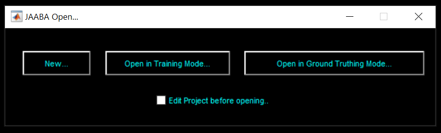
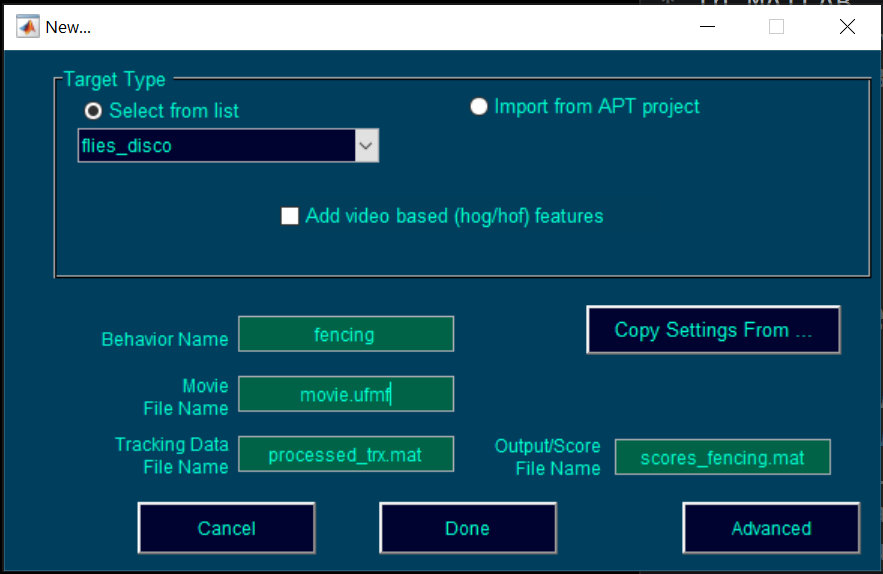
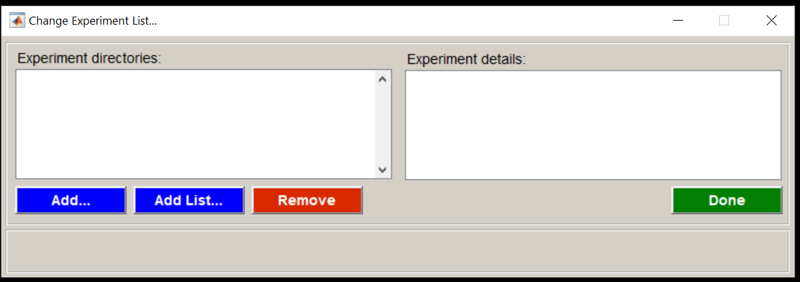
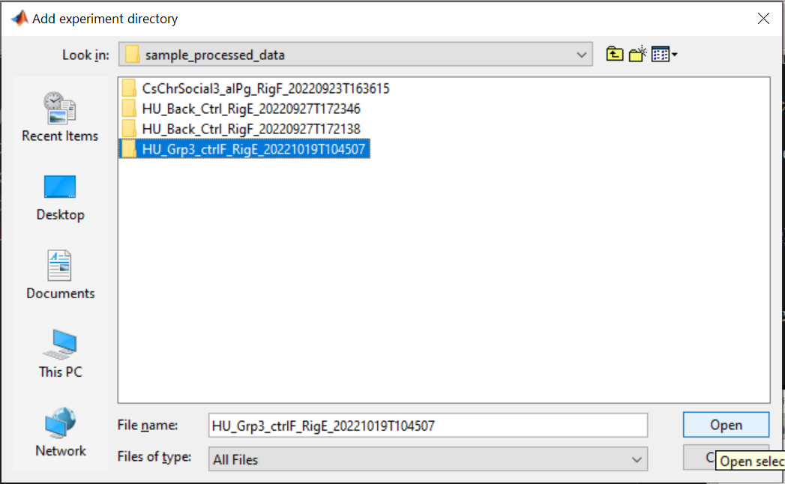
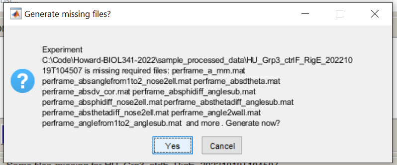
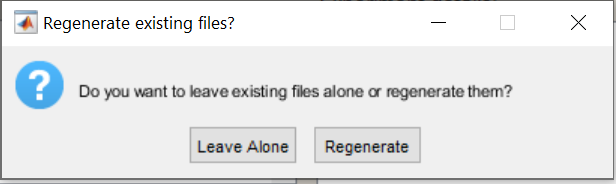
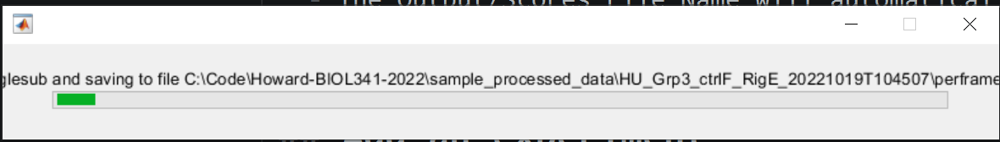
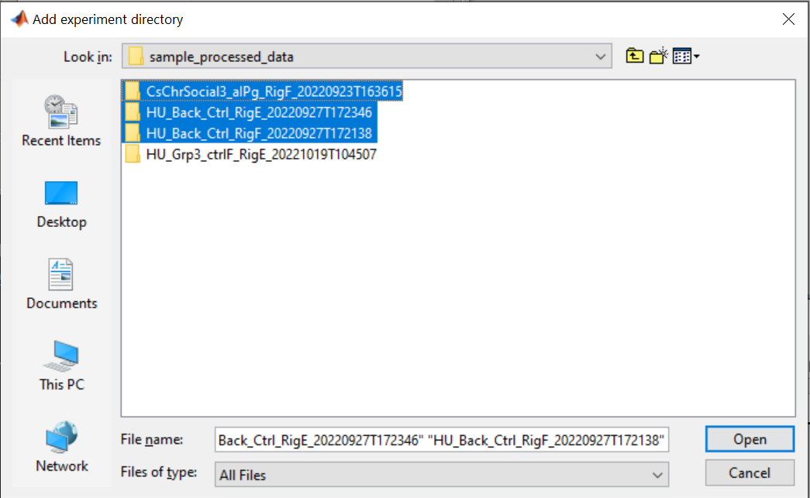
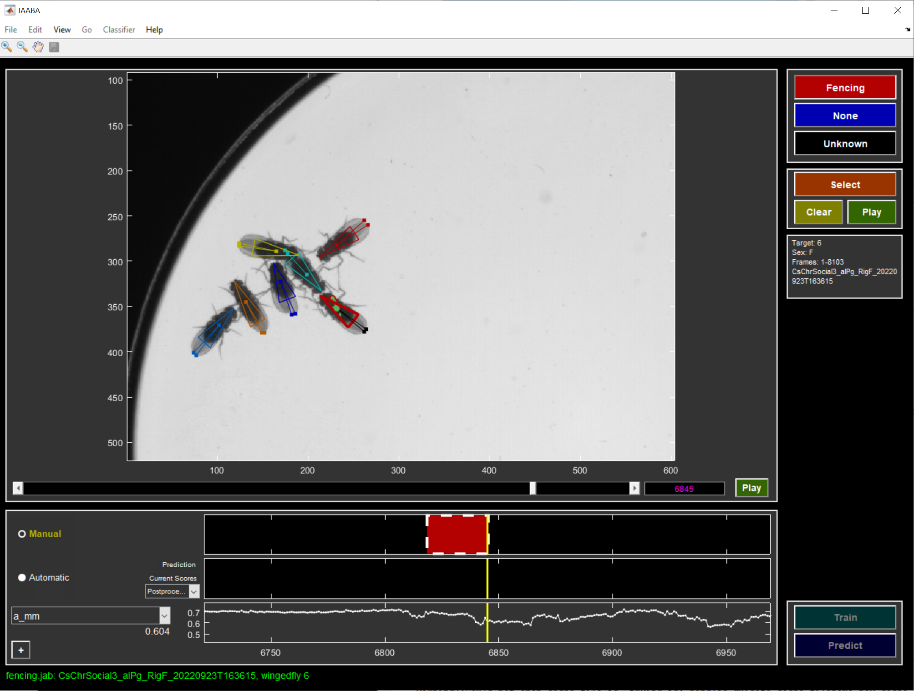
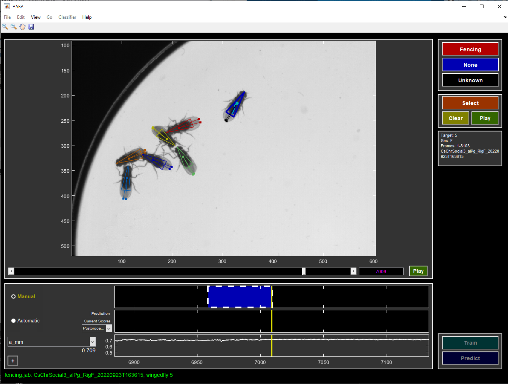

# JAABA Tutorial

We will train a machine learning classifier for a behavior you will define. 

Before you start using JAABA, you will need to choose a behavior you want to categorize. Think about what it looks like while the flies do that behavior. 

## Start JAABA
* Start MATLAB.
* In MATLAB, change into the directory `C:\Users\loaner\JAABA\perframe`.
* Launch JAABA by typing the following at the command line:
```
StartJAABA;
```

## Create a new project

* Select "New..." in the GUI.



* Set up your project as follows:

  - Select **flies_disco** as the Target Type.
  - Choose a name for your behavior that only has a letters and underscores in it.
  - Set the "Movie File Name" to **movie.ufmf**. 
  - Set the "Tracking Data File Name" to **processed_trx.mat**. 
  - The Output/Scores File Name will automatically be set to scores_< mybehavior >.mat. 
* Click the "Done" button. 

## Add an experiment
* Add one of your processed experiments by clicking the **Add...** button. 

* Select one experiment directory and click **Open**.

* Click **Yes** if it asks you whether you want to Generate missing files. 

* Click **Leave alone** if it asks you whether you want to Regenerate existing files. 

* Wait while it generates feature files.

* Add as many other experiments to the project as you want. You can add multiple movies by selecting them all. 

* Click the **Done** button when you are done. 
* In the main JAABA GUI, select **Save as...** to save your project as a .jab file. 

## Train a behavior classifier

* Find a frame and fly that is doing your behavior. You can scroll around in the video, zoom in and out, and double-click on a different fly to select a fly. You can also switch which video you want to label by selecting menu option **Go -> Switch Experiment...**. 
* Label some frames when the fly is doing your behavior. You can do this by navigating to the frame you want to label, then clicking the red Behavior button. When you click this button, it is like you are putting a pen down. Navigate forward in time a few frames while the fly continues to do the behavior. Click the red Behavior button again to pick the metaphorical pen back up. 

* Now find a fly and frame that is **not** doing the behavior. Label some frames by clicking the blue **None button**. 

* Label a handful more *bouts* of frames of the behavior and not the behavior. 
* Save your project. 
* Select the menu option **Classifier->Select Features**. 
* Choose which types of features you think the classifier should have access to:
  - **social**: Select *all* if the behavior involves multiple flies, e.g. chasing, fencing. If it is a behavior a fly does on its own, select *none*, e.g. backing up. 
  - locomotion: Select *all*.
  - **arena**: Select *none*.
  - **position**: Select *none*.
  - **identity**: Select *none*.
  - **compatibility**: Select *none*.
  - **wing appearance**: Select *all* if the knowing the wing position might be helpful for the classifier, e.g. wing flicking. Otherwise, select *none*. If in doubt, select *all*.
  - **wing motion**: Select *all* if wing movements might be helpful for the classifier, e.g. wing flicking. Otherwise, select *none*. If in doubt, select *all*.
* Click Done.
* Click the **Train** button to train your initial classifier. 
* Examine the classifier's predictions. Do you agree with them? Add more labels to correct the classifier. 
* Iterate. 
* Make sure to switch which movies, flies, and frames you label. Label in many of your movies, particularly in ones of different fly "types". Make sure to label both male and female flies (if you have both sexes). Make sure to label during and not during activation periods (if you did optogenetics). Make sure to label early and late in some movies. 
* Save often!

## Classify 
When you are happy enough with your classifier, you can run it on all of your videos. 
* If you want to add more videos, you can do this by selecting **File -> Change experiment list...**. 
* Select menu option **Classifier -> Predict -> All experiments** to run the classifier on all of the videos in your project.
* Select menu option **File -> Export Scores... ->  For All Experiments to Default Location** to save the classifier's outputs to files. This will make a file scores_\<mybehavior>.mat in each experiment directory. 

## Plot your results
See the new script **ScriptPlotJAABAResults.m** to plot and compare how often your flies do your behavior. 

## More information
* The documentation for JAABA is here:
[JAABA documentation](https://jaaba.sourceforge.net/). 
* There's a tutorial video here: 
[JAABA tutorial video](https://www.youtube.com/watch?v=6hdyVwNKepQ).